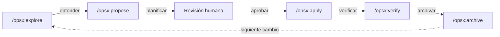

# 📐 OpenSpec — Framework de Especificaciones Vivas

> 📌 **Fuente oficial:** [Fission-AI/OpenSpec](https://github.com/Fission-AI/OpenSpec) · [openspec.dev](https://openspec.dev/)
>
> ⬅️ Volver al [README principal del repositorio](../README.md)

**OpenSpec** es un framework ligero y configurable para crear, refinar y gestionar especificaciones de software vivas (*living specifications*). Funciona como una **capa de acuerdo entre el desarrollador (o equipo) y el asistente de IA**: se acuerda *qué* construir antes de escribir código, y se verifica que la implementación coincida con lo especificado.

En este repositorio se utiliza OpenSpec en el proyecto de ejemplo `cartaya/`.

---

## 🧠 Filosofía: *Build the right thing, build it right*

OpenSpec se apoya en dos principios del [V&V (Verification & Validation)](https://en.wikipedia.org/wiki/Software_verification_and_validation#Definitions):

1. **Validación** (*Build the right thing*): ¿Estamos construyendo lo que el usuario necesita?
2. **Verificación** (*Build it right*): ¿La implementación coincide con la especificación?

Las specs viven en el repositorio junto al código. Un comportamiento que las specs no describen se considera un defecto, aunque el código funcione.

---

## 📊 Flujo de Trabajo (Workflow)

OpenSpec estructura cada cambio en **5 etapas secuenciales**. Todos los cambios siguen el mismo ciclo:



### Tabla Resumen de Etapas

| Etapa | Comando | Propósito |
| :--- | :--- | :--- |
| **1. Explore** | `/opsx:explore` | Mapear el problema y entender el codebase. El agente analiza el contexto, las specs existentes y el código antes de proponer nada. |
| **2. Propose** | `/opsx:propose` | Redactar la propuesta de cambio: genera `proposal.md`, deltas de specs en `specs/`, `design.md` y `tasks.md` dentro de una carpeta de cambio (`changes/<nombre>/`). |
| **3. Apply** | `/opsx:apply` | Implementar las tareas definidas en la propuesta. El agente escribe código y tests siguiendo el plan aprobado. |
| **4. Verify** | `/opsx:verify` | Comprobar que la implementación coincide con la spec. Ejecuta tests y valida coherencia entre código y especificación. |
| **5. Archive** | `/opsx:archive` | Archivar el cambio completado: mueve la propuesta a `changes/archive/`, fusiona los deltas de specs en las specs vivas del proyecto. |

> 💡 **Clave:** Entre **Propose** y **Apply** hay una **revisión humana obligatoria**. Se corrige el plan *antes* de que exista código, no después.

---

## 🔧 Instalación

### Prerrequisitos
* **Node.js**: Versión 20.19.0 o superior.
* **Asistente de IA**: Cualquiera de los [30+ agentes compatibles](https://openspec.dev/docs/supported-tools) (Claude Code, Cursor, GitHub Copilot, Gemini CLI, Antigravity, Codex, etc.).

### Instalación del CLI

```bash
# npm (recomendado)
npm install -g @fission-ai/openspec@latest

# pnpm
pnpm add -g @fission-ai/openspec@latest

# bun
bun add -g @fission-ai/openspec@latest

# yarn (solo Classic 1.x)
yarn global add @fission-ai/openspec@latest
```

### Instalación asistida por IA

Pega esto en tu chat con el agente de IA:
```
Fetch https://raw.githubusercontent.com/Fission-AI/OpenSpec/main/install.md and follow it.
```

### Inicializar un proyecto

```bash
openspec init
```

Esto crea la carpeta `openspec/` con la estructura base: `config.yaml`, `specs/` y `changes/`.

---

## 📁 Estructura de Artefactos

OpenSpec organiza las especificaciones y cambios bajo la carpeta `openspec/` en la raíz del proyecto:

```
proyecto/
└── openspec/
    ├── config.yaml         # Configuración del proyecto: contexto, reglas, schema
    ├── specs/              # Specs vivas (fuente de verdad del comportamiento)
    │   ├── .gitkeep
    │   ├── feature-a/
    │   │   └── spec.md     # Especificación de la feature A
    │   └── feature-b/
    │       └── spec.md     # Especificación de la feature B
    └── changes/            # Cambios propuestos y archivados
        ├── add-feature-c/  # Cambio activo (en progreso)
        │   ├── .openspec.yaml
        │   ├── proposal.md     # Propuesta del cambio
        │   ├── design.md       # Diseño técnico
        │   ├── tasks.md        # Checklist de tareas
        │   └── specs/          # Deltas de specs (nuevas o modificadas)
        │       └── spec.md
        └── archive/        # Cambios completados y archivados
```

### `config.yaml` — Configuración del Proyecto

El archivo `config.yaml` es el corazón de la configuración de OpenSpec. Define el contexto global, el schema y las reglas por artefacto que se inyectan al generar cada tipo de documento.

**Ejemplo real** (de `cartaya/openspec/config.yaml`):

```yaml
schema: spec-driven

# Se inyecta en TODAS las generaciones de artefactos
context: |
  CartaYa: carta digital con pedidos para una cafetería de barrio española.
  Stack técnico: Node.js 22 + Express + SQLite, React 19 + Vite, SSE.
  
  Principios innegociables:
  1. Idioma: español de España. Precios en euros con IVA incluido.
  2. Simplicidad ante todo.
  3. Privacidad por diseño: el cliente nunca se registra.
  4. La spec es la fuente de verdad.
  5. Accesibilidad real.

# Reglas específicas por tipo de artefacto
rules:
  specs:
    - Redacta en español conservando la palabra normativa inglesa (MUST/SHALL)
    - Reutiliza términos ya definidos; no introduzcas sinónimos nuevos
  proposal:
    - Registra cada decisión de negocio con su fecha
  design:
    - Ninguna dependencia nueva sin justificación escrita
```

---

## 💬 Cómo se Usa: Ejemplo con `/opsx:propose`

Para iniciar un nuevo cambio, se usa el comando `/opsx:propose` en el chat con el agente de IA, describiendo el cambio deseado con sus reglas de negocio:

```
/opsx:propose add-carta-digital — La carta digital pública de CartaYa para
la cafetería La Estación. Qué queremos: sustituir las cartas plastificadas
por una carta digital que el dueño mantiene al día.

Reglas de negocio:
- La carta se organiza en categorías con orden manual.
- Cada plato muestra: nombre, precio (€, IVA incluido), descripción,
  foto opcional y alérgenos (14 UE, siempre visibles).
- La carta es pública, sin identificación, carga en < 2s en 4G.
- El dueño gestiona desde una pantalla de admin protegida.

Fuera de alcance: pedido desde la mesa, panel de cocina...
```

El agente genera automáticamente `proposal.md`, `design.md`, `tasks.md` y los deltas de specs dentro de `changes/add-carta-digital/`.

> 📂 Los prompts de ejemplo usados en este proyecto están en `docs/`.

---

## 📂 Contenido de esta carpeta

* **`cartaya/`** — Proyecto de ejemplo desarrollado con OpenSpec (Node.js + Express + SQLite + React). Ver su propio [README](cartaya/README.md).
* **`docs/`** — Prompts de ejemplo usados en el flujo de OpenSpec.

---

## 🔗 Fuente y Documentación Oficial de OpenSpec

* **Sitio Web:** [https://openspec.dev/](https://openspec.dev/)
* **Documentación:** [https://openspec.dev/docs](https://openspec.dev/docs)
* **Repositorio GitHub:** [https://github.com/Fission-AI/OpenSpec](https://github.com/Fission-AI/OpenSpec)
* **Herramientas compatibles:** [https://openspec.dev/docs/supported-tools](https://openspec.dev/docs/supported-tools)
