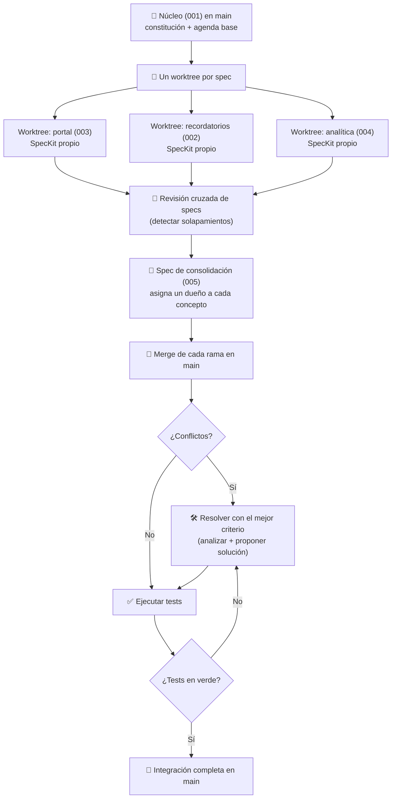

# 🌳 Multi-Spec — Varias Specs en Paralelo con Git Worktrees

> ⬅️ Volver al [README principal del repositorio](../README.md)

Esta sección explora cómo escalar el **Desarrollo Guiado por Especificaciones (SDD)** cuando un mismo proyecto necesita **varias specs avanzando a la vez**. En lugar de desarrollar una feature detrás de otra, se abre una **spec por rama**, cada una en su propio **git worktree** con su **ejecución independiente de SpecKit**, y al final todo se **integra en `main` resolviendo los conflictos** con el mejor criterio.

El proyecto de ejemplo es `citaclara/`, un gestor de citas para clínicas pequeñas, construido sobre un núcleo común (spec `001`) al que se le añaden en paralelo el portal del paciente, los recordatorios, la analítica y el acceso/cancelación del paciente.

---

## 🤔 ¿Qué problema resuelve?

En un flujo SDD de una sola spec, el desarrollo es secuencial: se especifica, se implementa y se verifica una feature antes de empezar la siguiente. Esto se vuelve un cuello de botella cuando:

- **Varias personas (o varios agentes de IA) trabajan a la vez** sobre el mismo producto.
- **Varias features son independientes entre sí** pero comparten un núcleo común.
- Se quiere **aislar cada línea de trabajo** para que un cambio en progreso no rompa a los demás.

La respuesta es trabajar con **múltiples specs en paralelo**, cada una aislada en su propio worktree, y afrontar la integración (y sus conflictos) como una fase explícita y controlada del flujo.

---

## 🧩 Conceptos Clave

### Git Worktrees

Un **worktree** permite tener **varias ramas de un mismo repositorio en carpetas distintas al mismo tiempo**, compartiendo un único historial `.git`. Así, cada spec vive en su propia carpeta de trabajo con su propia rama, sin pisarse y sin cambiar de rama constantemente con `checkout`.

```bash
# Desde el tronco (main), crear un worktree por feature
git worktree add ../citaclara-portal        portal
git worktree add ../citaclara-recordatorios  recordatorios
git worktree add ../citaclara-analitica      analitica

# Ver todos los worktrees activos
git worktree list
```

Cada carpeta es un entorno de trabajo completo: puedes abrir un agente de IA en cada una y ejecutar su propio ciclo de SpecKit sin interferencias.

### Una spec por rama/worktree

Cada feature nueva nace como una spec numerada (`002`, `003`, `004`, `005`…) en su propia rama, y se desarrolla con el flujo estándar de SpecKit (`/speckit.specify` → `plan` → `tasks` → `analyze` → `implement`). El núcleo (`001`) vive en `main` y es consumido por todas las demás.

### MAPA de specs: propiedad y relaciones

Con varias specs vivas a la vez, el riesgo capital es el **solapamiento**: dos specs que definen el mismo concepto de forma distinta. Para evitarlo, el proyecto mantiene un **`specs/MAPA.md`** que fija **un único propietario por spec** y por **concepto** (quién define cada regla y quién la consume). Ninguna spec consumidora redefine un concepto ajeno.

---

## 📊 Flujo de Trabajo (Workflow)



### Resumen de fases

| Fase | Qué ocurre | Resultado |
| :--- | :--- | :--- |
| **1. Núcleo** | Se establece la constitución y la spec `001` (agenda base) en `main`. | Base común que todas las features consumen. |
| **2. Ramificar** | Se abre un worktree + rama por cada spec nueva (`002`, `003`, `004`). | Entornos aislados que avanzan en paralelo. |
| **3. Especificar/Implementar** | Cada worktree ejecuta su propio ciclo de SpecKit. | Specs y código por feature, sin interferencias. |
| **4. Revisión cruzada** | Se leen todas las specs desde el tronco (sin checkout) y se detectan solapamientos. | Informe de conflictos entre specs. |
| **5. Consolidar** | Se crea una spec dueña de los conceptos compartidos (`005`). | Un único propietario por concepto. |
| **6. Integrar** | Se hace merge de cada rama en `main`. | Features reunidas en el tronco. |
| **7. Resolver + verificar** | Se resuelven conflictos con el mejor criterio y se ejecutan los tests. | `main` integrado y en verde. |

---

## 🔀 Integración y Resolución de Conflictos

La integración es una fase de primera clase, no un trámite. Al reunir varias specs sobre el mismo núcleo, los conflictos pueden aparecer en **dos niveles**:

1. **Conflicto de specs (lógico):** dos specs definen el mismo concepto (identidad del paciente, política de cancelación, definición de una métrica…) de forma incompatible. Se detecta **antes** de mezclar código, en la fase de revisión cruzada, y se resuelve asignando **un único propietario** al concepto.
2. **Conflicto de código (merge):** dos ramas tocan los mismos archivos. Se resuelve en el merge aplicando el mejor criterio y, acto seguido, ejecutando los tests.

Estrategia recomendada al integrar cada rama en `main`:

```text
1) Merge de la rama de la feature con main.
2) Si hay conflicto: analizar la causa, proponer la resolución completa
   (coherente con el MAPA de propiedad) e implementarla.
3) Si entra limpio: ejecutar los tests de la aplicación.
   Si fallan, analizar los fallos y resolver antes de dar por buena la integración.
```

> 💡 La regla de oro: **la spec propietaria manda**. Cualquier texto o código que comunique una regla (p. ej., la política de cancelación) debe **derivarse** de su spec dueña, nunca reescribirla. Esto convierte muchos conflictos de código en decisiones ya resueltas a nivel de spec.

---

## 🗂️ El Proyecto de Ejemplo: `citaclara/`

**CitaClara** es un gestor de citas para clínicas y consultas pequeñas (fisioterapia, nutrición, podología), diseñado desde el primer día para operar con **varias features y varios agentes en paralelo**.

### Specs del proyecto

| # | Spec | Rol | Consume | Consumida por |
| :--- | :--- | :--- | :--- | :--- |
| **001** | Núcleo de Agenda | Entidades, estados de la cita y regla anti-solape. Vive en `main`. | — | 002, 003, 004, 005 |
| **002** | Recordatorios de Cita | Email diario para citas de las próximas 24–48 h. | 001, 004, 005 | — |
| **003** | Portal del Paciente | Página personal para ver y cancelar citas desde el móvil. | 001, 005 | — |
| **004** | Panel de Analítica | Panel de solo lectura: ocupación, ingresos y no asistencia. | 001 | 002 |
| **005** | Acceso y Cancelación del Paciente | Fuente de verdad del acceso sin cuenta (`/p/[token]`) y la política de cancelación. | 001 | 002, 003 |

> 📄 `specs/000-revision-cruzada-jul2026.md` es el **informe de revisión cruzada** que detecta los solapamientos entre specs. La `005` nace para resolverlos, asignando un dueño único al acceso del paciente y a la política de cancelación.
>
> 📄 `specs/MAPA.md` es el **mapa global de propiedad y relaciones**: un propietario por spec y por concepto.

---

## 📂 Contenido de esta carpeta

* **`citaclara/`** — Proyecto de ejemplo desarrollado con varias specs en paralelo (Next.js + TypeScript + Drizzle + SQLite), orquestado con SpecKit sobre git worktrees.
* **`docs/`** — Prompts de ejemplo usados en el flujo multi-spec:
  * `prompt_constitucion.txt` — Constitución del proyecto (principios de negocio y calidad).
  * `promp_primera_spec_citaclara.txt` — Spec del núcleo de agenda (`001`).
  * `prompts_specs_paralelas.txt` — Las tres specs que se desarrollan en paralelo (`002`, `003`, `004`).
  * `prompt_revision_specs.txt` — Análisis de solapamiento entre specs leídas desde el tronco.
  * `prompt_nueva_spec.txt` — Spec de consolidación (`005`) que resuelve los solapamientos.
  * `prompt_merge_worktrees.txt` — Integración de una rama de feature con merge y resolución de conflictos.

---

## 🔗 Referencias

* **Git Worktrees:** [git-scm.com/docs/git-worktree](https://git-scm.com/docs/git-worktree)
* **GitHub SpecKit:** [github.com/github/spec-kit](https://github.com/github/spec-kit) · ver también la sección [`2_github_spec_kit/`](../2_github_spec_kit/README.md) de este repositorio.
