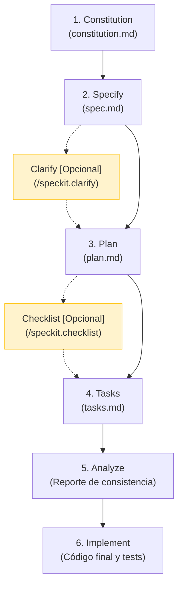

# 🛠️ GitHub SpecKit — Ciclo de Desarrollo Guiado por Especificaciones (SDD)

> 📌 **Fuente oficial:** [github/spec-kit](https://github.com/github/spec-kit)

**GitHub SpecKit** es un toolkit open-source ideado para implementar **Desarrollo Guiado por Especificaciones (Spec-Driven Development o SDD)**. Estructura el ciclo de vida del desarrollo de software a través de comandos específicos que generan y validan artefactos, asegurando la alineación entre la intención de negocio, el diseño técnico y el código resultante.

---

## 📊 Flujo General y Tabla de Comandos



### Tabla Resumen de Etapas

| Etapa | Comando | Tipo | Artefacto Generado | Propósito Principal |
| :--- | :--- | :--- | :--- | :--- |
| **1. Constitution** | `/speckit.constitution` | 🟢 Obligatorio | `constitution.md` | Define las reglas inquebrantables del proyecto. |
| **2. Specify** | `/speckit.specify` | 🟢 Obligatorio | `spec.md` | Define los requisitos y comportamiento (el *QUÉ*). |
| **— Clarify** | `/speckit.clarify` | 🟡 **Opcional** | N/A (Edita `spec.md`) | Q&A interactivo para eliminar ambigüedades. |
| **3. Plan** | `/speckit.plan` | 🟢 Obligatorio | `plan.md` | Diseña la arquitectura y técnica (el *CÓMO*). |
| **— Checklist** | `/speckit.checklist` | 🟡 **Opcional** | `checklist.md` | Pruebas unitarias de calidad para la especificación. |
| **4. Tasks** | `/speckit.tasks` | 🟢 Obligatorio | `tasks.md` | Checklist secuencial de tareas de código. |
| **5. Analyze** | `/speckit.analyze` | 🟢 Obligatorio | Reporte en consola | Auditoría de consistencia entre spec, plan y tasks. |
| **6. Implement** | `/speckit.implement` | 🟢 Obligatorio | Código fuente y Tests | Escritura del código y verificación. |

---

## 🔧 Instalación y Configuración

### 1. Prerrequisitos
* **Python**: Versión 3.11 o superior.
* **Git**: Para el control de versiones.
* **Gestor de paquetes**: [`uv`](https://docs.astral.sh/uv/).
* **Asistente de IA**: Un agente compatible configurado en tu entorno. Consulta la lista completa en la [Referencia de Integraciones de Agentes IA](https://github.github.io/spec-kit/reference/integrations.html).

### 2. Instalación de `specify-cli`

Instalación utilizando **`uv`**:
```bash
uv tool install specify-cli --from git+https://github.com/github/spec-kit.git@vX.Y.Z
```
*(Reemplaza `vX.Y.Z` por la versión/etiqueta de release deseada, por ejemplo `v1.0.0`).*

### 3. Inicializar un Proyecto

#### En un proyecto nuevo:
```bash
specify init mi-proyecto --integration <agente-ia>
cd mi-proyecto
```

#### En un proyecto existente (Brownfield):
```bash
cd mi-proyecto-existente
specify init . --integration <agente-ia>
```

*(Reemplaza `<agente-ia>` por el identificador de tu agente. Consulta las opciones disponibles en la documentación de [integraciones](https://github.github.io/spec-kit/reference/integrations.html)).*

---

## 📋 Etapas del Ciclo de Vida SpecKit

### 1. Constitution (Constitución)
* **Comando:** `/speckit.constitution`
* **Tipo:** 🟢 Obligatorio
* **Propósito:** Establecer los principios rectores, estándares de codificación y lineamientos arquitectónicos inquebrantables del proyecto.
* **Artefacto:** `constitution.md` (habitualmente ubicado bajo `/memory/` o la raíz de configuración).
* **Descripción:** Define las directrices globales del repositorio (ej. "TDD obligatorio", "Diseño offline-first", etc.). Funciona como la máxima autoridad del proyecto: todas las decisiones posteriores en el desarrollo técnico de cualquier característica deben respetarla.

---

### 2. Specify (Especificación)
* **Comando:** `/speckit.specify`
* **Tipo:** 🟢 Obligatorio
* **Propósito:** Definir el comportamiento funcional y los requisitos de la característica desde la perspectiva del usuario (el *QUÉ* y *POR QUÉ*), manteniéndose agnóstico a la tecnología.
* **Artefacto:** `spec.md` (dentro del directorio de la feature).
* **Descripción:** Traduce las ideas iniciales en un documento estructurado que detalla:
  * **User Stories / Escenarios de usuario:** Priorizados por importancia (P1, P2, P3) y testeables de manera independiente.
  * **Requisitos Funcionales:** Comportamientos esperados del sistema.
  * **Criterios de Aceptación:** Reglas concretas con ejemplos de negocio.
  * **Casos Límite (Edge Cases):** Manejo de errores y límites.

---

### 💡 Clarify (Clarificación) — [OPCIONAL]
* **Comando:** `/speckit.clarify`
* **Tipo:** 🟡 Opcional *(Recomendado)*
* **Momento:** Inmediatamente después de `Specify` (`/speckit.specify`).
* **Propósito:** Iniciar una sesión interactiva de preguntas y respuestas donde el asistente de IA analiza la especificación y solicita aclaraciones sobre puntos ambiguos, vacíos de negocio o decisiones no tomadas.
* **Impacto:** Refina y actualiza directamente el archivo `spec.md` existente antes de avanzar a la planificación técnica.

> 🧠 **Tip de Selección de Modelo:** Durante la sesión de **Clarify**, se recomienda utilizar los modelos de IA de mayor razonamiento del mercado (ej. **Claude Opus / Sonnet**, **Gemini 3.5 / 3.6 Pro**, **OpenAI GPT-5 / o3 / o4**). Estos modelos destacan en la detección de contradicciones y casos de borde sutiles que modelos más rápidos suelen pasar por alto.

---

### 3. Plan (Planificación)
* **Comando:** `/speckit.plan`
* **Tipo:** 🟢 Obligatorio
* **Propósito:** Diseñar la propuesta de arquitectura técnica y planificar los pasos necesarios para llevar a cabo la especificación.
* **Artefacto:** `plan.md`
* **Descripción:** Traduce los requerimientos del `spec.md` a un plan de acción técnica estructurado que define:
  * El stack tecnológico y dependencias a utilizar.
  * La estructura exacta de los archivos a crear, modificar o eliminar.
  * Un **Chequeo de la Constitución (Constitution Check)** para asegurar la alineación con los principios definidos en la Etapa 1.

---

### 💡 Checklist (Validación de Requisitos) — [OPCIONAL]
* **Comando:** `/speckit.checklist`
* **Tipo:** 🟡 Opcional *(Recomendado)*
* **Momento:** Inmediatamente después de `Plan` (`/speckit.plan`) o `Specify` (`/speckit.specify`).
* **Propósito:** Generar una lista de verificación de la calidad de los requisitos (`checklist.md`).
* **Impacto:** Funciona como *"pruebas unitarias para las especificaciones"*. Valida que la especificación sea clara, medible, completa y libre de ambigüedades antes de desglosar las tareas de código, evitando la desviación del alcance (*Spec-Drift*).

---

### 4. Tasks (Tareas)
* **Comando:** `/speckit.tasks`
* **Tipo:** 🟢 Obligatorio
* **Propósito:** Descomponer el plan técnico y la especificación en una lista ordenada y accionable de tareas de desarrollo.
* **Artefacto:** `tasks.md`
* **Descripción:** Genera un checklist interactivo (`- [ ]`) que desglosa el trabajo por fases (datos, backend, componentes, tests) y marca qué componentes pueden ser desarrollados en paralelo. Sirve de guía secuencial para la etapa de implementación.

---

### 5. Analyze (Análisis de Consistencia)
* **Comando:** `/speckit.analyze`
* **Tipo:** 🟢 Obligatorio
* **Propósito:** Validar la coherencia cruzada y la calidad de los artefactos generados antes de comenzar a escribir código.
* **Artefacto:** Reporte en consola o archivo temporal generado por `analyze.md`.
* **Descripción:** Es una **etapa de solo lectura (read-only)** que actúa como puerta de calidad (*quality gate*). Compara de forma cruzada `spec.md`, `plan.md` y `tasks.md` frente a la `constitution.md` para:
  * Identificar contradicciones entre el plan técnico y la especificación.
  * Detectar si hay tareas huérfanas (sin requerimientos asociados) o requerimientos sin tareas de implementación.
  * Asegurar que no se viola ningún principio establecido en la constitución del proyecto.

> 🧠 **Tip de Selección de Modelo:** Durante la etapa de **Analyze** (`/speckit.analyze`), es crítico usar modelos de IA avanzados y de razonamiento profundo (como **Claude Opus / Sonnet**, **Gemini 3.5 / 3.6 Pro** u **OpenAI GPT-5 / o3 / o4**). Al ser una auditoría cruzada entre la constitución, la spec, el plan y las tareas, un modelo de máxima capacidad garantizará descubrir brechas lógicas complejas antes de pasar a la escritura de código.

---

### 6. Implement (Implementación)
* **Comando:** `/speckit.implement`
* **Tipo:** 🟢 Obligatorio
* **Propósito:** Ejecutar la codificación real y verificación de la funcionalidad basada en las etapas previas.
* **Descripción:** El programador o asistente de IA edita y crea los archivos definidos en el plan de trabajo. A medida que avanza, va marcando el progreso en `tasks.md` (`[/]` para tareas en curso y `[x]` para completadas) y escribe las pruebas automatizadas necesarias para validar los criterios de aceptación.

---

## 🔗 Fuente y Documentación Oficial

* **Repositorio Oficial de GitHub SpecKit:** [https://github.com/github/spec-kit](https://github.com/github/spec-kit)
* **Documentación e Integraciones:** [https://github.github.io/spec-kit/](https://github.github.io/spec-kit/)
