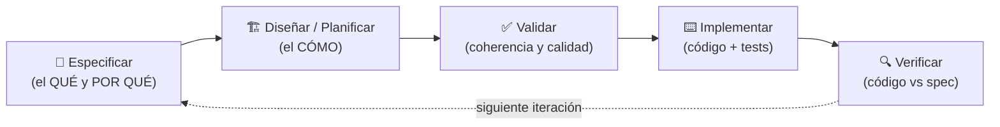

# 🛠️ Desarrollo Guiado por Especificaciones (SDD)

> Repositorio de estudio y práctica de **Spec-Driven Development (SDD)**, explorando distintos frameworks y enfoques a través de proyectos de ejemplo.

**Desarrollo Guiado por Especificaciones (SDD)** es una metodología que estructura el ciclo de vida del software a través de especificaciones formales, asegurando la alineación entre la intención de negocio, el diseño técnico y el código resultante. En lugar de escribir código primero y documentar después, se acuerda *qué* construir mediante una especificación, y el código se deriva y verifica contra ella.

---

## 🤔 ¿Qué problema resuelve?

En el desarrollo tradicional —y especialmente al programar con asistentes de IA— es habitual saltar directamente al código a partir de un prompt ambiguo. Esto genera problemas recurrentes:

- **Desviación de intención (*spec-drift*):** lo que se construye se aleja de lo que realmente se necesitaba.
- **Contexto perdido:** las decisiones de negocio quedan solo en conversaciones o en la cabeza del desarrollador, no en el repositorio.
- **Retrabajo caro:** los errores se detectan cuando ya hay código escrito, no antes.
- **IA sin rumbo:** un agente de IA sin una especificación clara produce resultados inconsistentes e impredecibles.

SDD ataca esto poniendo la **especificación como fuente de verdad**: primero se acuerda *qué* y *por qué*, luego *cómo*, y solo entonces se escribe el código.

---

## 🧭 Principios Fundamentales

1. **La especificación es la fuente de verdad.** El código sirve a la spec, no al revés. Si el comportamiento no está en la spec, es un defecto.
2. **Separar el *qué* del *cómo*.** Primero se define el comportamiento y las reglas de negocio (agnóstico a la tecnología); el diseño técnico viene después.
3. **Validar antes de codificar.** Las ambigüedades y contradicciones se resuelven sobre el documento, cuando corregir es barato.
4. **Verificación continua.** La implementación se contrasta contra la especificación acordada (*build it right*).
5. **Documentación viva.** Las specs evolucionan con el proyecto y viven junto al código en el repositorio.

---

## 🔄 Flujo Conceptual

Aunque cada framework tiene su propio ciclo, todos comparten el mismo esqueleto conceptual:

| Fase | Pregunta que responde | Resultado |
| :--- | :--- | :--- |
| **Especificar** | ¿Qué se construye y por qué? | Requisitos y reglas de negocio |
| **Diseñar** | ¿Cómo se construye? | Arquitectura y plan técnico |
| **Validar** | ¿Es coherente y completo? | Spec libre de ambigüedades |
| **Implementar** | — | Código y pruebas |
| **Verificar** | ¿El código cumple la spec? | Implementación validada |

---

## ✨ Beneficios

- **Alineación** entre negocio, diseño técnico y código.
- **Menos retrabajo:** los errores se detectan en la fase de especificación, no en producción.
- **IA más efectiva:** un agente con una spec clara produce resultados consistentes y verificables.
- **Trazabilidad:** cada línea de código puede rastrearse hasta un requisito.
- **Onboarding más rápido:** las specs documentan el *porqué* de las decisiones.

---

## 📚 Contenido del Repositorio

El repositorio está organizado por temas. Cada carpeta contiene su propia documentación detallada y, cuando aplica, proyectos de ejemplo.

| # | Tema | Descripción | Documentación |
| :--- | :--- | :--- | :--- |
| **1** | **Introducción** | Fundamentos de SDD: qué es, por qué usarlo y proyectos introductorios. | [`1_introduccion/`](1_introduccion/) |
| **2** | **GitHub SpecKit** | Toolkit de GitHub con 6 etapas y una *constitución* como autoridad máxima del proyecto. | [`2_github_spec_kit/`](2_github_spec_kit/README.md) |
| **3** | **OpenSpec** | Framework de Fission AI con 5 etapas y un ciclo de *propuesta → specs vivas*. | [`3_open_spec/`](3_open_spec/README.md) |
| **4** | **Multi-Agente** | Exploración de flujos SDD con múltiples agentes de IA. | [`4_multi_agent/`](4_multi_agent/) |

---

## ⚖️ Comparación: SpecKit vs OpenSpec

Ambas herramientas implementan **Desarrollo Guiado por Especificaciones (SDD)**, pero con enfoques diferentes:

| Aspecto | **SpecKit** (GitHub) | **OpenSpec** (Fission AI) |
| :--- | :--- | :--- |
| **Origen** | GitHub | Fission AI (open source, MIT) |
| **Lenguaje del CLI** | Python (`specify-cli`) | Node.js (`@fission-ai/openspec`) |
| **Configuración** | `constitution.md` + sistema propio | `config.yaml` (contexto, reglas, schema) |
| **Ciclo de vida** | 6 etapas: Constitution → Specify → Plan → Tasks → Analyze → Implement | 5 etapas: Explore → Propose → Apply → Verify → Archive |
| **Comandos** | `/speckit.*` (ej. `/speckit.specify`) | `/opsx:*` (ej. `/opsx:propose`) |
| **Fuente de verdad** | `spec.md`, `plan.md`, `tasks.md` por feature | `openspec/specs/` (specs vivas) + `openspec/changes/` (propuestas) |
| **Gestión de cambios** | Cada feature genera sus propios artefactos | Sistema de propuestas: `proposal.md` → deltas de specs → archive |
| **Validación cruzada** | `/speckit.analyze` (auditoría read-only) | `/opsx:verify` (verifica implementación vs spec) |
| **Pasos opcionales** | Clarify, Checklist | El flujo es fijo (5 pasos) |
| **Compatibilidad** | Agentes IA específicos (ver integraciones) | 30+ agentes de IA (Claude Code, Cursor, Copilot, Gemini CLI, etc.) |
| **Uso en este repo** | `2_github_spec_kit/` | `3_open_spec/` |

> 💡 **SpecKit** pone énfasis en la *constitución del proyecto* como autoridad máxima y en la validación de calidad de requisitos (checklist). **OpenSpec** se centra en un *ciclo de propuesta-implementación-archivo* donde las specs son documentos vivos que evolucionan con cada cambio archivado.
>
> 📖 Para el detalle completo de cada framework, consulta la documentación de su tema:
> [SpecKit](2_github_spec_kit/README.md) · [OpenSpec](3_open_spec/README.md)

---

## 🔗 Fuentes y Documentación Oficial

* **GitHub SpecKit:** [github.com/github/spec-kit](https://github.com/github/spec-kit) · [Docs](https://github.github.io/spec-kit/)
* **OpenSpec:** [openspec.dev](https://openspec.dev/) · [github.com/Fission-AI/OpenSpec](https://github.com/Fission-AI/OpenSpec)
