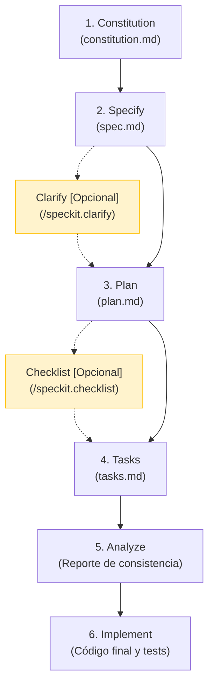
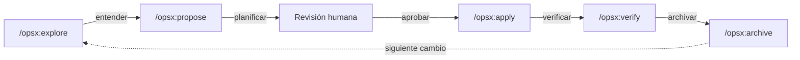

# 🛠️ Desarrollo Guiado por Especificaciones (SDD) — SpecKit & OpenSpec

> Repositorio de estudio y práctica de **Spec-Driven Development (SDD)** utilizando dos frameworks: [GitHub SpecKit](https://github.com/github/spec-kit) y [OpenSpec](https://openspec.dev/).

**Desarrollo Guiado por Especificaciones (SDD)** es una metodología que estructura el ciclo de vida del software a través de especificaciones formales, asegurando la alineación entre la intención de negocio, el diseño técnico y el código resultante. En este repositorio se exploran dos herramientas que implementan SDD:

- **GitHub SpecKit** (`tema_1/`, `tema_2/`) — Toolkit con 6 etapas y una *constitución* como autoridad máxima del proyecto.
- **OpenSpec** (`tema_3/`) — Framework con 5 etapas y un ciclo de *propuesta → specs vivas*.

---
---

# 🛠️ GitHub SpecKit

> 📌 **Fuente oficial:** [github/spec-kit](https://github.com/github/spec-kit)

**GitHub SpecKit** es un toolkit open-source ideado para implementar SDD. Estructura el ciclo de vida del desarrollo de software a través de comandos específicos que generan y validan artefactos, asegurando la alineación entre la intención de negocio, el diseño técnico y el código resultante.

---

## 📊 Flujo General y Tabla de Comandos



### Tabla Resumen de Etapas

| Etapa | Comando | Tipo | Artefacto Generado | Propósito Principal |
| :--- | :--- | :--- | :--- | :--- |
| **1. Constitution** | `/speckit.constitution` | 🟢 Obligatorio | `constitution.md` | Define las reglas inquebrantables del proyecto. |
| **2. Specify** | `/speckit.specify` | 🟢 Obligatorio | `spec.md` | Define los requisitos y comportamiento (el *QUÉ*). |
| **— Clarify** | `/speckit.clarify` | 🟡 **Opcional** | N/A (Edita `spec.md`) | Q&A interactivo para eliminar ambigüedades. |
| **3. Plan** | `/speckit.plan` | 🟢 Obligatorio | `plan.md` | Diseña la arquitectura y técnica (el *CÓMO*). |
| **— Checklist** | `/speckit.checklist` | 🟡 **Opcional** | `checklist.md` | Pruebas unitarias de calidad para la especificación. |
| **4. Tasks** | `/speckit.tasks` | 🟢 Obligatorio | `tasks.md` | Checklist secuencial de tareas de código. |
| **5. Analyze** | `/speckit.analyze` | 🟢 Obligatorio | Reporte en consola | Auditoría de consistencia entre spec, plan y tasks. |
| **6. Implement** | `/speckit.implement` | 🟢 Obligatorio | Código fuente y Tests | Escritura del código y verificación. |

---

## 🔧 Instalación y Configuración

### 1. Prerrequisitos
* **Python**: Versión 3.11 o superior.
* **Git**: Para el control de versiones.
* **Gestor de paquetes**: [`uv`](https://docs.astral.sh/uv/).
* **Asistente de IA**: Un agente compatible configurado en tu entorno. Consulta la lista completa en la [Referencia de Integraciones de Agentes IA](https://github.github.io/spec-kit/reference/integrations.html).

### 2. Instalación de `specify-cli`

Instalación utilizando **`uv`**:
```bash
uv tool install specify-cli --from git+https://github.com/github/spec-kit.git@vX.Y.Z
```
*(Reemplaza `vX.Y.Z` por la versión/etiqueta de release deseada, por ejemplo `v1.0.0`).*

### 3. Inicializar un Proyecto

#### En un proyecto nuevo:
```bash
specify init mi-proyecto --integration <agente-ia>
cd mi-proyecto
```

#### En un proyecto existente (Brownfield):
```bash
cd mi-proyecto-existente
specify init . --integration <agente-ia>
```

*(Reemplaza `<agente-ia>` por el identificador de tu agente. Consulta las opciones disponibles en la documentación de [integraciones](https://github.github.io/spec-kit/reference/integrations.html)).*

---

## 📋 Etapas del Ciclo de Vida SpecKit

### 1. Constitution (Constitución)
* **Comando:** `/speckit.constitution`
* **Tipo:** 🟢 Obligatorio
* **Propósito:** Establecer los principios rectores, estándares de codificación y lineamientos arquitectónicos inquebrantables del proyecto.
* **Artefacto:** `constitution.md` (habitualmente ubicado bajo `/memory/` o la raíz de configuración).
* **Descripción:** Define las directrices globales del repositorio (ej. "TDD obligatorio", "Diseño offline-first", etc.). Funciona como la máxima autoridad del proyecto: todas las decisiones posteriores en el desarrollo técnico de cualquier característica deben respetarla.

---

### 2. Specify (Especificación)
* **Comando:** `/speckit.specify`
* **Tipo:** 🟢 Obligatorio
* **Propósito:** Definir el comportamiento funcional y los requisitos de la característica desde la perspectiva del usuario (el *QUÉ* y *POR QUÉ*), manteniéndose agnóstico a la tecnología.
* **Artefacto:** `spec.md` (dentro del directorio de la feature).
* **Descripción:** Traduce las ideas iniciales en un documento estructurado que detalla:
  * **User Stories / Escenarios de usuario:** Priorizados por importancia (P1, P2, P3) y testeables de manera independiente.
  * **Requisitos Funcionales:** Comportamientos esperados del sistema.
  * **Criterios de Aceptación:** Reglas concretas con ejemplos de negocio.
  * **Casos Límite (Edge Cases):** Manejo de errores y límites.

---

### 💡 Clarify (Clarificación) — [OPCIONAL]
* **Comando:** `/speckit.clarify`
* **Tipo:** 🟡 Opcional *(Recomendado)*
* **Momento:** Inmediatamente después de `Specify` (`/speckit.specify`).
* **Propósito:** Iniciar una sesión interactiva de preguntas y respuestas donde el asistente de IA analiza la especificación y solicita aclaraciones sobre puntos ambiguos, vacíos de negocio o decisiones no tomadas.
* **Impacto:** Refina y actualiza directamente el archivo `spec.md` existente antes de avanzar a la planificación técnica.

> 🧠 **Tip de Selección de Modelo:** Durante la sesión de **Clarify**, se recomienda utilizar los modelos de IA de mayor razonamiento del mercado (ej. **Claude Opus / Sonnet**, **Gemini 3.5 / 3.6 Pro**, **OpenAI GPT-5 / o3 / o4**). Estos modelos destacan en la detección de contradicciones y casos de borde sutiles que modelos más rápidos suelen pasar por alto.

---

### 3. Plan (Planificación)
* **Comando:** `/speckit.plan`
* **Tipo:** 🟢 Obligatorio
* **Propósito:** Diseñar la propuesta de arquitectura técnica y planificar los pasos necesarios para llevar a cabo la especificación.
* **Artefacto:** `plan.md`
* **Descripción:** Traduce los requerimientos del `spec.md` a un plan de acción técnica estructurado que define:
  * El stack tecnológico y dependencias a utilizar.
  * La estructura exacta de los archivos a crear, modificar o eliminar.
  * Un **Chequeo de la Constitución (Constitution Check)** para asegurar la alineación con los principios definidos en la Etapa 1.

---

### 💡 Checklist (Validación de Requisitos) — [OPCIONAL]
* **Comando:** `/speckit.checklist`
* **Tipo:** 🟡 Opcional *(Recomendado)*
* **Momento:** Inmediatamente después de `Plan` (`/speckit.plan`) o `Specify` (`/speckit.specify`).
* **Propósito:** Generar una lista de verificación de la calidad de los requisitos (`checklist.md`).
* **Impacto:** Funciona como *"pruebas unitarias para las especificaciones"*. Valida que la especificación sea clara, medible, completa y libre de ambigüedades antes de desglosar las tareas de código, evitando la desviación del alcance (*Spec-Drift*).

---

### 4. Tasks (Tareas)
* **Comando:** `/speckit.tasks`
* **Tipo:** 🟢 Obligatorio
* **Propósito:** Descomponer el plan técnico y la especificación en una lista ordenada y accionable de tareas de desarrollo.
* **Artefacto:** `tasks.md`
* **Descripción:** Genera un checklist interactivo (`- [ ]`) que desglosa el trabajo por fases (datos, backend, componentes, tests) y marca qué componentes pueden ser desarrollados en paralelo. Sirve de guía secuencial para la etapa de implementación.

---

### 5. Analyze (Análisis de Consistencia)
* **Comando:** `/speckit.analyze`
* **Tipo:** 🟢 Obligatorio
* **Propósito:** Validar la coherencia cruzada y la calidad de los artefactos generados antes de comenzar a escribir código.
* **Artefacto:** Reporte en consola o archivo temporal generado por `analyze.md`.
* **Descripción:** Es una **etapa de solo lectura (read-only)** que actúa como puerta de calidad (*quality gate*). Compara de forma cruzada `spec.md`, `plan.md` y `tasks.md` frente a la `constitution.md` para:
  * Identificar contradicciones entre el plan técnico y la especificación.
  * Detectar si hay tareas huérfanas (sin requerimientos asociados) o requerimientos sin tareas de implementación.
  * Asegurar que no se viola ningún principio establecido en la constitución del proyecto.

> 🧠 **Tip de Selección de Modelo:** Durante la etapa de **Analyze** (`/speckit.analyze`), es crítico usar modelos de IA avanzados y de razonamiento profundo (como **Claude Opus / Sonnet**, **Gemini 3.5 / 3.6 Pro** u **OpenAI GPT-5 / o3 / o4**). Al ser una auditoría cruzada entre la constitución, la spec, el plan y las tareas, un modelo de máxima capacidad garantizará descubrir brechas lógicas complejas antes de pasar a la escritura de código.

---

### 6. Implement (Implementación)
* **Comando:** `/speckit.implement`
* **Tipo:** 🟢 Obligatorio
* **Propósito:** Ejecutar la codificación real y verificación de la funcionalidad basada en las etapas previas.
* **Descripción:** El programador o asistente de IA edita y crea los archivos definidos en el plan de trabajo. A medida que avanza, va marcando el progreso en `tasks.md` (`[/]` para tareas en curso y `[x]` para completadas) y escribe las pruebas automatizadas necesarias para validar los criterios de aceptación.

---

## 🔗 Fuente y Documentación Oficial de SpecKit

* **Repositorio Oficial de GitHub SpecKit:** [https://github.com/github/spec-kit](https://github.com/github/spec-kit)
* **Documentación e Integraciones:** [https://github.github.io/spec-kit/](https://github.github.io/spec-kit/)

---
---

# 📐 OpenSpec — Framework de Especificaciones Vivas

> 📌 **Fuente oficial:** [Fission-AI/OpenSpec](https://github.com/Fission-AI/OpenSpec) · [openspec.dev](https://openspec.dev/)

**OpenSpec** es un framework ligero y configurable para crear, refinar y gestionar especificaciones de software vivas (*living specifications*). Funciona como una **capa de acuerdo entre el desarrollador (o equipo) y el asistente de IA**: se acuerda *qué* construir antes de escribir código, y se verifica que la implementación coincida con lo especificado.

En este repositorio se utiliza OpenSpec en el **Tema 3** (`tema_3/cartaya/`) como herramienta principal de SDD.

---

## 🧠 Filosofía: *Build the right thing, build it right*

OpenSpec se apoya en dos principios del [V&V (Verification & Validation)](https://en.wikipedia.org/wiki/Software_verification_and_validation#Definitions):

1. **Validación** (*Build the right thing*): ¿Estamos construyendo lo que el usuario necesita?
2. **Verificación** (*Build it right*): ¿La implementación coincide con la especificación?

Las specs viven en el repositorio junto al código. Un comportamiento que las specs no describen se considera un defecto, aunque el código funcione.

---

## 📊 Flujo de Trabajo (Workflow)

OpenSpec estructura cada cambio en **5 etapas secuenciales**. Todos los cambios siguen el mismo ciclo:



### Tabla Resumen de Etapas

| Etapa | Comando | Propósito |
| :--- | :--- | :--- |
| **1. Explore** | `/opsx:explore` | Mapear el problema y entender el codebase. El agente analiza el contexto, las specs existentes y el código antes de proponer nada. |
| **2. Propose** | `/opsx:propose` | Redactar la propuesta de cambio: genera `proposal.md`, deltas de specs en `specs/`, `design.md` y `tasks.md` dentro de una carpeta de cambio (`changes/<nombre>/`). |
| **3. Apply** | `/opsx:apply` | Implementar las tareas definidas en la propuesta. El agente escribe código y tests siguiendo el plan aprobado. |
| **4. Verify** | `/opsx:verify` | Comprobar que la implementación coincide con la spec. Ejecuta tests y valida coherencia entre código y especificación. |
| **5. Archive** | `/opsx:archive` | Archivar el cambio completado: mueve la propuesta a `changes/archive/`, fusiona los deltas de specs en las specs vivas del proyecto. |

> 💡 **Clave:** Entre **Propose** y **Apply** hay una **revisión humana obligatoria**. Se corrige el plan *antes* de que exista código, no después.

---

## 🔧 Instalación

### Prerrequisitos
* **Node.js**: Versión 20.19.0 o superior.
* **Asistente de IA**: Cualquiera de los [30+ agentes compatibles](https://openspec.dev/docs/supported-tools) (Claude Code, Cursor, GitHub Copilot, Gemini CLI, Antigravity, Codex, etc.).

### Instalación del CLI

```bash
# npm (recomendado)
npm install -g @fission-ai/openspec@latest

# pnpm
pnpm add -g @fission-ai/openspec@latest

# bun
bun add -g @fission-ai/openspec@latest

# yarn (solo Classic 1.x)
yarn global add @fission-ai/openspec@latest
```

### Instalación asistida por IA

Pega esto en tu chat con el agente de IA:
```
Fetch https://raw.githubusercontent.com/Fission-AI/OpenSpec/main/install.md and follow it.
```

### Inicializar un proyecto

```bash
openspec init
```

Esto crea la carpeta `openspec/` con la estructura base: `config.yaml`, `specs/` y `changes/`.

---

## 📁 Estructura de Artefactos

OpenSpec organiza las especificaciones y cambios bajo la carpeta `openspec/` en la raíz del proyecto:

```
proyecto/
└── openspec/
    ├── config.yaml         # Configuración del proyecto: contexto, reglas, schema
    ├── specs/              # Specs vivas (fuente de verdad del comportamiento)
    │   ├── .gitkeep
    │   ├── feature-a/
    │   │   └── spec.md     # Especificación de la feature A
    │   └── feature-b/
    │       └── spec.md     # Especificación de la feature B
    └── changes/            # Cambios propuestos y archivados
        ├── add-feature-c/  # Cambio activo (en progreso)
        │   ├── .openspec.yaml
        │   ├── proposal.md     # Propuesta del cambio
        │   ├── design.md       # Diseño técnico
        │   ├── tasks.md        # Checklist de tareas
        │   └── specs/          # Deltas de specs (nuevas o modificadas)
        │       └── spec.md
        └── archive/        # Cambios completados y archivados
```

### `config.yaml` — Configuración del Proyecto

El archivo `config.yaml` es el corazón de la configuración de OpenSpec. Define el contexto global, el schema y las reglas por artefacto que se inyectan al generar cada tipo de documento.

**Ejemplo real** (de `tema_3/cartaya/openspec/config.yaml`):

```yaml
schema: spec-driven

# Se inyecta en TODAS las generaciones de artefactos
context: |
  CartaYa: carta digital con pedidos para una cafetería de barrio española.
  Stack técnico: Node.js 22 + Express + SQLite, React 19 + Vite, SSE.
  
  Principios innegociables:
  1. Idioma: español de España. Precios en euros con IVA incluido.
  2. Simplicidad ante todo.
  3. Privacidad por diseño: el cliente nunca se registra.
  4. La spec es la fuente de verdad.
  5. Accesibilidad real.

# Reglas específicas por tipo de artefacto
rules:
  specs:
    - Redacta en español conservando la palabra normativa inglesa (MUST/SHALL)
    - Reutiliza términos ya definidos; no introduzcas sinónimos nuevos
  proposal:
    - Registra cada decisión de negocio con su fecha
  design:
    - Ninguna dependencia nueva sin justificación escrita
```

---

## 💬 Cómo se Usa: Ejemplo con `/opsx:propose`

Para iniciar un nuevo cambio, se usa el comando `/opsx:propose` en el chat con el agente de IA, describiendo el cambio deseado con sus reglas de negocio:

```
/opsx:propose add-carta-digital — La carta digital pública de CartaYa para
la cafetería La Estación. Qué queremos: sustituir las cartas plastificadas
por una carta digital que el dueño mantiene al día.

Reglas de negocio:
- La carta se organiza en categorías con orden manual.
- Cada plato muestra: nombre, precio (€, IVA incluido), descripción,
  foto opcional y alérgenos (14 UE, siempre visibles).
- La carta es pública, sin identificación, carga en < 2s en 4G.
- El dueño gestiona desde una pantalla de admin protegida.

Fuera de alcance: pedido desde la mesa, panel de cocina...
```

El agente genera automáticamente `proposal.md`, `design.md`, `tasks.md` y los deltas de specs dentro de `changes/add-carta-digital/`.

> 📂 Los prompts de ejemplo usados en este proyecto están en `tema_3/docs/`.

---

## ⚖️ Comparación: SpecKit vs OpenSpec

Ambas herramientas implementan **Desarrollo Guiado por Especificaciones (SDD)**, pero con enfoques diferentes:

| Aspecto | **SpecKit** (GitHub) | **OpenSpec** (Fission AI) |
| :--- | :--- | :--- |
| **Origen** | GitHub | Fission AI (open source, MIT) |
| **Lenguaje del CLI** | Python (`specify-cli`) | Node.js (`@fission-ai/openspec`) |
| **Configuración** | `constitution.md` + sistema propio | `config.yaml` (contexto, reglas, schema) |
| **Ciclo de vida** | 6 etapas: Constitution → Specify → Plan → Tasks → Analyze → Implement | 5 etapas: Explore → Propose → Apply → Verify → Archive |
| **Comandos** | `/speckit.*` (ej. `/speckit.specify`) | `/opsx:*` (ej. `/opsx:propose`) |
| **Fuente de verdad** | `spec.md`, `plan.md`, `tasks.md` por feature | `openspec/specs/` (specs vivas) + `openspec/changes/` (propuestas) |
| **Gestión de cambios** | Cada feature genera sus propios artefactos | Sistema de propuestas: `proposal.md` → deltas de specs → archive |
| **Validación cruzada** | `/speckit.analyze` (auditoría read-only) | `/opsx:verify` (verifica implementación vs spec) |
| **Pasos opcionales** | Clarify, Checklist | El flujo es fijo (5 pasos) |
| **Compatibilidad** | Agentes IA específicos (ver integraciones) | 30+ agentes de IA (Claude Code, Cursor, Copilot, Gemini CLI, etc.) |
| **Uso en este repo** | `tema_1/`, `tema_2/` | `tema_3/` |

> 💡 **SpecKit** pone énfasis en la *constitución del proyecto* como autoridad máxima y en la validación de calidad de requisitos (checklist). **OpenSpec** se centra en un *ciclo de propuesta-implementación-archivo* donde las specs son documentos vivos que evolucionan con cada cambio archivado.

---

## 🔗 Fuente y Documentación Oficial de OpenSpec

* **Sitio Web:** [https://openspec.dev/](https://openspec.dev/)
* **Documentación:** [https://openspec.dev/docs](https://openspec.dev/docs)
* **Repositorio GitHub:** [https://github.com/Fission-AI/OpenSpec](https://github.com/Fission-AI/OpenSpec)
* **Herramientas compatibles:** [https://openspec.dev/docs/supported-tools](https://openspec.dev/docs/supported-tools)
